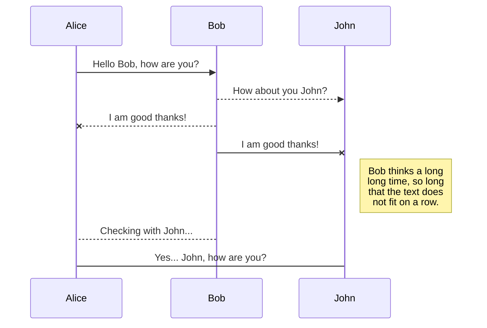
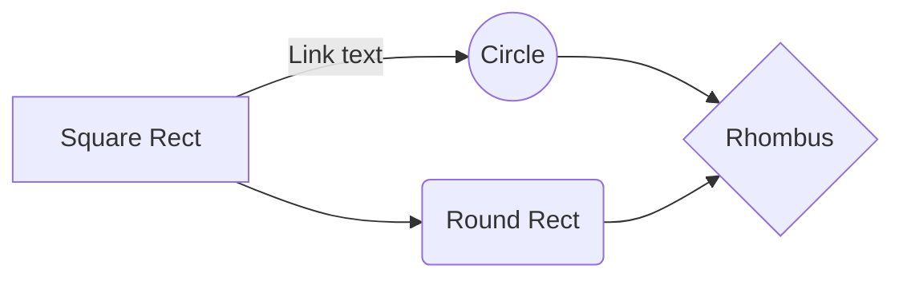

# Ruby On Rail Deployment!

**Step by step instructions to install and deploy Ruby on Rails.**
https://ubuntu.com/download/server
Either use the user account you created during the installation or create a user with sudo privileges after installation. 

- Run:
```
 sudo apt update
```
- Run:
```
sudo apt upgrade
```

## Install Dependencies

- Run:
```
sudo apt install -y curl gnupg2 dirmngr git-core zlib1g-dev build-essential libssl-dev libreadline-dev libyaml-dev libsqlite3-dev sqlite3 libxml2-dev libxslt1-dev libcurl4-openssl-dev software-properties-common libffi-dev
```

## Install Node.js
**Latest Release**

- Run:
```
curl -sL https://deb.nodesource.com/setup_16.x | sudo -E bash -
```
- Run:
```
sudo apt install -y nodejs
```
- Run:
```
sudo apt-get install gcc g++ make
```

## Install yarn
**Add to Repository**

- Run:
```
curl -sL https://dl.yarnpkg.com/debian/pubkey.gpg | gpg --dearmor | sudo tee /usr/share/keyrings/yarnkey.gpg >/dev/null
```
- Run:
```
echo "deb [signed-by=/usr/share/keyrings/yarnkey.gpg] https://dl.yarnpkg.com/debian stable main" | sudo tee /etc/apt/sources.list.d/yarn.list
```

**Installation Command**

- Run:
```
sudo apt update && sudo apt install -y yarn
```

## Install Ruby
**Use rbenv**
**Clone from repo**

- Run:
```
cd ~
```
- Run:
```
git clone https://github.com/rbenv/rbenv.git ~/.rbenv
```

**Append bashrc file**
- Run:
```
echo 'export PATH="$HOME/.rbenv/bin:$PATH"' >> ~/.bashrc
```
- Run:
```
echo 'eval "$(rbenv init -)"' >> ~/.bashrc
```
- Run:
```
exec $SHELL
```

**Clone from repo**

- Run:
```
git clone https://github.com/rbenv/ruby-build.git ~/.rbenv/plugins/ruby-build
```

**Append bashrc file**
- Run:
```
echo 'export PATH="$HOME/.rbenv/plugins/ruby-build/bin:$PATH"' >> ~/.bashrc
```
- Run:
```
exec $SHELL
```

**Installation Command**
**Latest Version (3.0.2)**

- Run:
```
rbenv install 3.0.2
```
- Run:
```
rbenv global 3.0.2
```

**Check Ruby Version**

- Run:
```
ruby -v
```

>Output should look like:
ruby 3.0.2p107 (2021-07-07 revision 0db68f0233) [x86_64-linux]

**Install the Bundler**

- Run:
```
gem install bundler
```

## Install Rails
**Installation Command**

- Run:
```
gem install rails
```

**Check Version**

- Run:
```
rails -v
```

>Output:
Rails 6.1.4.1

# Create Rails Application
## Install MariaDB
**Use Ubuntu Repository**

- Run:
```
sudo apt update
```
- Run:
```
sudo apt install -y mariadb-server mariadb-client
```
- Run:
```
sudo apt install -y libmariadb-dev
```

**Use mysql secure installation**

- Run:
```
sudo mysql_secure_installation
```

> In order to log into MariaDB to secure it, we'll need the current
password for the root user. If you've just installed MariaDB, and
haven't set the root password yet, you should just press enter here.
Enter current password for root (enter for none): << Just Press Enter
OK, successfully used password, moving on...
Change the root password? [Y/n] Y << Set MariaDB root password
New password: **<< Enter New Psssword
Re-enter new password: *** << Re-Enter New Password
Password updated successfully!
Reloading privilege tables..
... Success!
By default, a MariaDB installation has an anonymous user, allowing anyone
to log into MariaDB without having to have a user account created for
them. This is intended only for testing, and to make the installation
go a bit smoother. You should remove them before moving into a
production environment.
Remove anonymous users? [Y/n] Y << Remove Anonymous Users
... Success!
Normally, root should only be allowed to connect from 'localhost'. This
ensures that someone cannot guess at the root password from the network.
Disallow root login remotely? [Y/n] Y << Disallow root login remotely
... Success!
By default, MariaDB comes with a database named 'test' that anyone can
access. This is also intended only for testing, and should be removed
before moving into a production environment.
Remove test database and access to it? [Y/n] Y << Remove test database
-Dropping test database...
... Success!
-Removing privileges on test database...
... Success!
Reloading the privilege tables will ensure that all changes made so far
will take effect immediately.
Reload privilege tables now? [Y/n] Y << Reload Tables
... Success!
Cleaning up...
All done! If you've completed all of the above steps, your MariaDB
installation should now be secure.
Thanks for using MariaDB!

**Log into MariaDB as root user**

- Run:
```
sudo mysql -u root -p
```

> Use root password you created in mysql_secure_installation.
> 
Enter, use mysql;

Than enter, update user set plugin='mysql_native_password' where user='root';

Next enter, flush privileges;

Lastly enter, quit;

## Create a Database
**Create Database User**
**Login as root**

- Run:
```
sudo mysql -u root -p
```

Enter, CREATE USER 'user'@'localhost' IDENTIFIED BY 'password' ;

Next enter, GRANT ALL PRIVILEGES ON *.* TO 'user'@'localhost' ;

Than enter, exit

> Use the user you are logged in under.

**Install the mysql2 extension**

- Run:
```
gem install mysql2
```

**Create Rails Application**

- Run:
```
cd ~
```
- Run:
```
rails new myapp -d mysql
```

> You can name your new **myapp** whatever you want.

- Run:
```
cd myapp
```

**Update configuration file with the database information.**

- Run
```
sudo vi config/database.yml
```

>>
Enter DB user details shown like below.
default: &default
adapter: mysql2
encoding: utf8mb4
pool: <%= ENV.fetch("RAILS_MAX_THREADS") { 5 } %>
username: root << DB User
password: **** << DB Password
socket: /var/run/mysqld/mysqld.sock
>>

**Create the Database**

- Run:
```
rake db:create
```

>>
Output:
Created database 'myapp_development'
Created database 'myapp_test'


## Validate Rails Application
- Run:
```
rails server -b 0.0.0.0
```
[Welcome_Page](Images/Welcome_Rails.png)

# Publication

Publishing in StackEdit makes it simple for you to publish online your files. Once you're happy with a file, you can publish it to different hosting platforms like **Blogger**, **Dropbox**, **Gist**, **GitHub**, **Google Drive**, **WordPress** and **Zendesk**. With [Handlebars templates](http://handlebarsjs.com/), you have full control over what you export.

> Before starting to publish, you must link an account in the **Publish** sub-menu.

## Publish a File

You can publish your file by opening the **Publish** sub-menu and by clicking **Publish to**. For some locations, you can choose between the following formats:

- Markdown: publish the Markdown text on a website that can interpret it (**GitHub** for instance),
- HTML: publish the file converted to HTML via a Handlebars template (on a blog for example).

## Update a publication

After publishing, StackEdit keeps your file linked to that publication which makes it easy for you to re-publish it. Once you have modified your file and you want to update your publication, click on the **Publish now** button in the navigation bar.

> **Note:** The **Publish now** button is disabled if your file has not been published yet.

## Manage file publication

Since one file can be published to multiple locations, you can list and manage publish locations by clicking **File publication** in the **Publish** sub-menu. This allows you to list and remove publication locations that are linked to your file.


# Markdown extensions

StackEdit extends the standard Markdown syntax by adding extra **Markdown extensions**, providing you with some nice features.

> **ProTip:** You can disable any **Markdown extension** in the **File properties** dialog.


## SmartyPants

SmartyPants converts ASCII punctuation characters into "smart" typographic punctuation HTML entities. For example:

|                |ASCII                          |HTML                         |
|----------------|-------------------------------|-----------------------------|
|Single backticks|`'Isn't this fun?'`            |'Isn't this fun?'            |
|Quotes          |`"Isn't this fun?"`            |"Isn't this fun?"            |
|Dashes          |`-- is en-dash, --- is em-dash`|-- is en-dash, --- is em-dash|


## KaTeX

You can render LaTeX mathematical expressions using [KaTeX](https://khan.github.io/KaTeX/):

The *Gamma function* satisfying $\Gamma(n) = (n-1)!\quad\forall n\in\mathbb N$ is via the Euler integral

$$
\Gamma(z) = \int_0^\infty t^{z-1}e^{-t}dt\,.
$$

> You can find more information about **LaTeX** mathematical expressions [here](http://meta.math.stackexchange.com/questions/5020/mathjax-basic-tutorial-and-quick-reference).


## UML diagrams

You can render UML diagrams using [Mermaid](https://mermaidjs.github.io/). For example, this will produce a sequence diagram:



And this will produce a flow chart:


# Project-3
